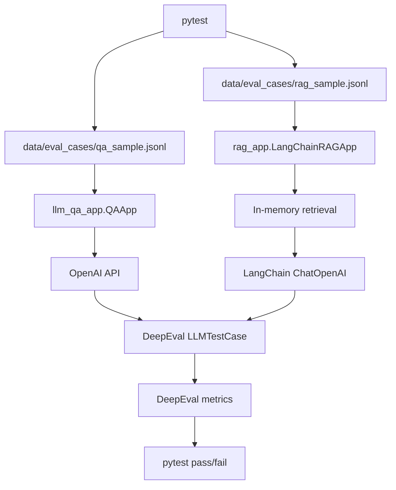

# アーキテクチャ

このプロジェクトは、OpenAI を使った簡易QAアプリ、LangChain を使った簡易RAGアプリ、DeepEval による LLM 性能評価テストを持ちます。

## 設計方針

- `app/llm_qa_app/` に非RAGのQAアプリを置く。
- `app/rag_app/` にLangChainベースの簡易RAGアプリを置く。
- `tests/` にはDeepEvalによる性能評価テストを置く。
- 通常のユニットテストや評価ランナー用の独立スクリプトは持たない。
- 評価データは `data/eval_cases/` に置く。

## ソース構成

```text
app/
  llm_qa_app/
    cli.py
    providers.py
    qa_app.py
  rag_app/
    rag_app.py
data/
  eval_cases/
    qa_sample.jsonl
    rag_sample.jsonl
tests/
  test_llm_eval.py
  test_rag_eval.py
```

## 実行フロー



## 評価データ

評価データは JSONL です。各行は1つの評価ケースを表します。

```json
{"id":"qa_001","input":"DeepEvalとは何ですか？","expected_output":"DeepEvalはLLMアプリケーションの出力品質を評価するためのフレームワークです。","tags":["qa","baseline"]}
```

QA評価では `qa_sample.jsonl`、RAG評価では `rag_sample.jsonl` を使います。
