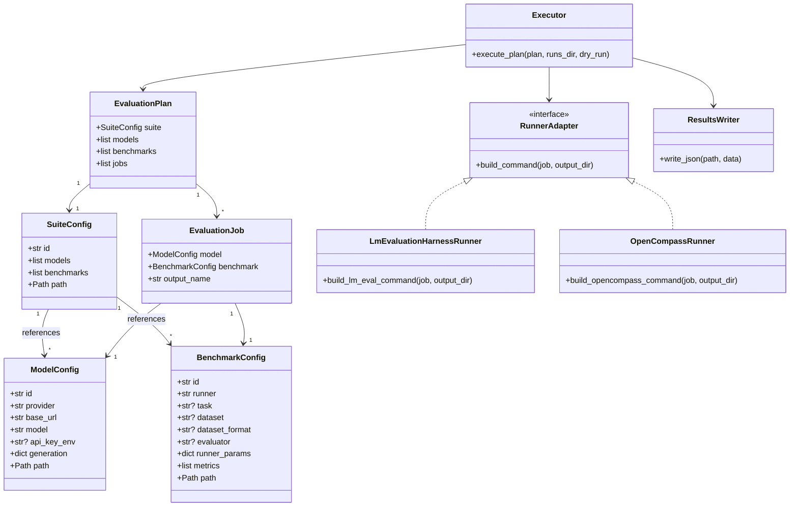

# local-llm-eval Architecture

このリポジトリは、ローカル LLM 評価ジョブを suite 中心に管理します。

```text
suite YAML
  -> model YAML
  -> benchmark YAML
  -> runner adapter
  -> lm-evaluation-harness / OpenCompass
  -> runs/
```

## 責務

`local-llm-eval` は、評価フレームワークそのものではありません。lm-evaluation-harness と OpenCompass を実行バックエンドとして扱い、設定解決、ジョブ展開、外部コマンド生成、実行結果保存を担当します。

モデル推論と採点は、可能な限り既存の評価フレームワークに委譲します。

## 主要コンポーネント

```text
src/local_llm_eval/
  cli.py
    validate / run の単一エントリーポイント

  config.py
    model / benchmark / suite YAML の読み込みと検証

  planner.py
    suite を model x benchmark の評価ジョブへ展開

  executor.py
    評価ジョブを実行し、summary を保存

  results.py
    JSON 結果ファイルの書き出し

  runners/
    lm_evaluation_harness.py
      lm-evaluation-harness 向けコマンド生成

    opencompass.py
      OpenCompass 向け一時 config とコマンド生成
```

## クラス構成



`SuiteConfig` は実行単位を表し、複数の `ModelConfig` と `BenchmarkConfig` を参照します。`planner.py` はこれらを `EvaluationPlan` と `EvaluationJob` に展開し、`executor.py` が runner adapter を通じて外部評価フレームワークのコマンドを生成・実行します。

## 評価資産

```text
config/models/
  1モデル接続 = 1 YAML

config/benchmarks/
  1ベンチマーク = 1 YAML

config/suites/
  実行したい model YAML と benchmark YAML を参照

datasets/
  自作データセット

runs/
  実行ごとの run.yaml.json、summary.json、raw 出力
```

評価フレームワークは実行バックエンドとして扱い、データセットや実行結果はフレームワーク別に大きく分断しません。

## エラー処理

YAML の構造不備、参照ファイルの欠落、不明な runner などの検証エラーは、実行前に停止します。

実行時に個別ジョブが失敗した場合は、残りのジョブを継続し、`summary.json` に `failed` と終了コードを記録します。
