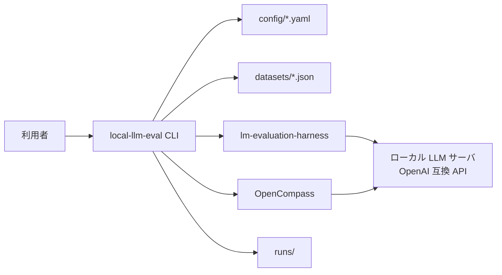
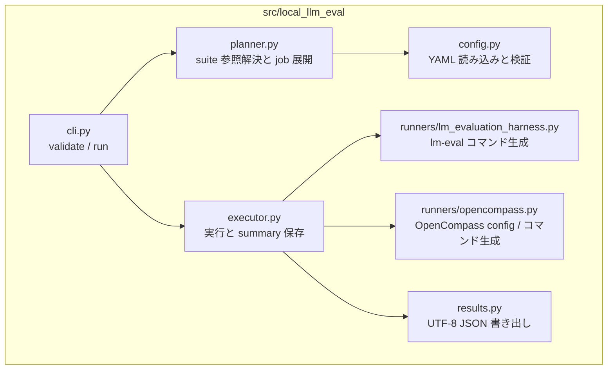
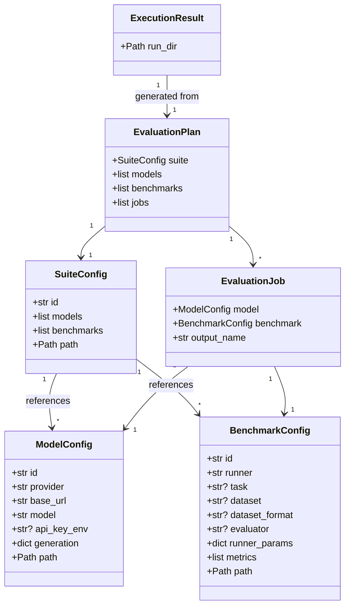
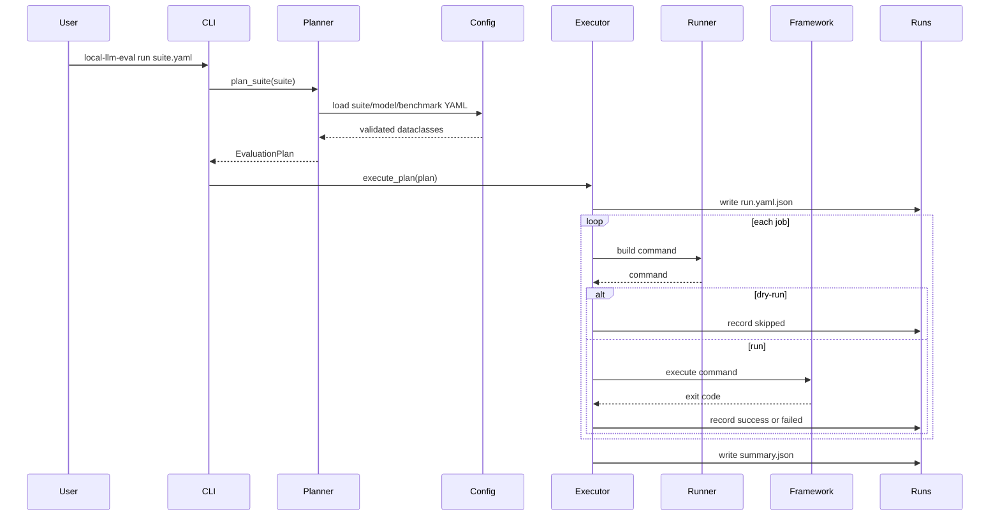
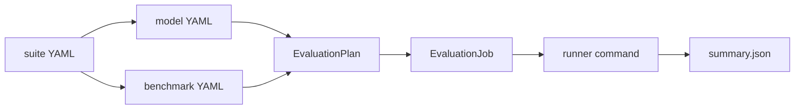
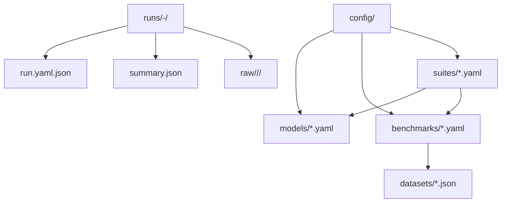
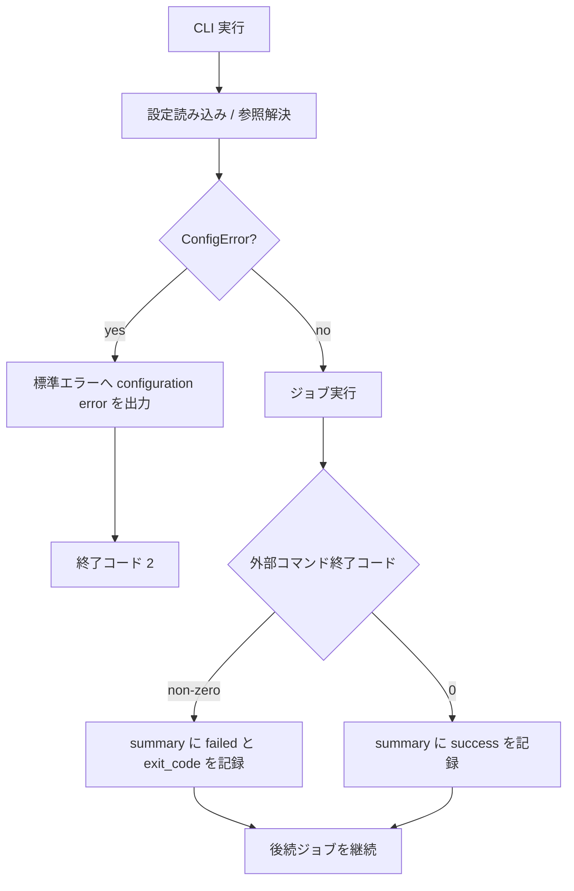

# システムダイアグラム

## 概要

`local-llm-eval` は、設定解決と外部評価フレームワークの起動を分離した CLI アプリケーションである。モデル推論や採点は lm-evaluation-harness / OpenCompass に委譲し、本体は薄い orchestration 層に留める。

## システムコンテキスト図

## コンポーネント図

## クラス図

## シーケンス図

## データフロー図

## データモデル / 永続化図

## エラー時フロー

