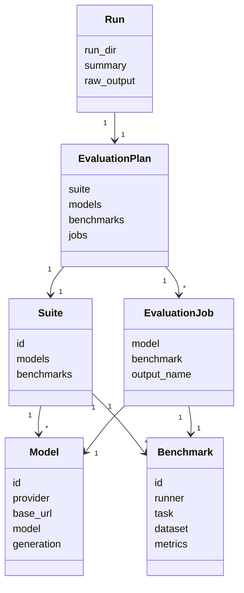

# ドメインモデル

## 中核概念

### Model

ローカル LLM サーバへの接続設定。OpenAI 互換 API の `base_url` と、サーバへ渡す `model` 名を持つ。

### Benchmark

評価対象タスクまたはデータセットの設定。runner 名、task、dataset、metrics、runner 固有パラメーターを持つ。

### Suite

実行したい model YAML と benchmark YAML の束。評価バッチの入口になる。

### EvaluationPlan

解決済み suite と、その suite から読み込まれた model、benchmark、展開済み job の集合。

### EvaluationJob

1 つの model と 1 つの benchmark の組み合わせ。runner adapter が外部評価コマンドを生成する単位。

### RunnerAdapter

runner ごとの差分を吸収し、`EvaluationJob` から外部コマンドと必要な補助ファイルを生成する境界。

### Run

1 回の `run` 実行で作られる出力ディレクトリ。実行計画、summary、raw 出力を含む。

## 関係

- 1 つの suite は複数の model 参照と benchmark 参照を持つ。
- 1 つの `EvaluationPlan` は 1 つの suite から作られる。
- 1 つの `EvaluationPlan` は、model と benchmark の直積から作られた複数の `EvaluationJob` を持つ。
- 1 つの `EvaluationJob` は 1 つの model と 1 つの benchmark を持つ。
- 1 つの benchmark は 1 つの runner 名を持ち、runner adapter の選択に使われる。
- 1 つの run は 1 つの `EvaluationPlan` の実行または dry-run に対応する。

## 不変条件

- model provider は `openai_compatible` である。
- benchmark runner は `lm-evaluation-harness` または `OpenCompass` である。
- suite の `models` と `benchmarks` は文字列リストである。
- `EvaluationJob.output_name` は `<model.id>/<benchmark.id>` である。
- JSON 出力は UTF-8 とし、日本語を必要なくエスケープしない。
- `runs/` 配下の成果は生成物であり、正本ドキュメントやソース成果物ではない。

## ライフサイクル

1. 利用者が model、benchmark、suite YAML を用意する。
2. CLI が suite を読み込み、model と benchmark の参照を解決する。
3. planner が `EvaluationPlan` と `EvaluationJob` を作る。
4. executor が run ディレクトリを作成し、`run.yaml.json` を保存する。
5. runner adapter が job ごとのコマンドを生成する。
6. dry-run では実行を省略し、通常実行では外部コマンドを呼ぶ。
7. executor が job 結果を `summary.json` に保存する。

## ユーザーが触る概念

- `config/models/*.yaml`
- `config/benchmarks/*.yaml`
- `config/suites/*.yaml`
- `datasets/*.json`
- `local-llm-eval validate`
- `local-llm-eval run`
- `runs/<timestamp>-<suite>/summary.json`

## 内部概念

- `ConfigError`
- `ModelConfig`
- `BenchmarkConfig`
- `SuiteConfig`
- `EvaluationPlan`
- `EvaluationJob`
- `CommandRunner`
- `ExecutionResult`
- `write_json`

## 図

